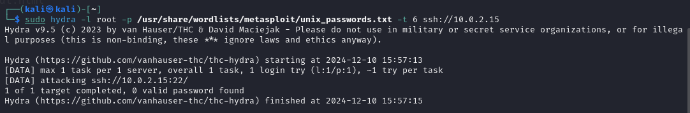
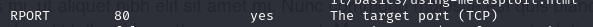

# Rapport du TP2

On commence par scanner toutes les machines sur le réseau
`sudo netdiscover -r 10.0.2.0/24`

Cela nous permet d'obtenir l'adresse ip de la machine que l'on souhaite attaquer : 10.0.2.15/24

On test la connection entre les 2 machines
`ping 10.0.2.15`

Tout fonctionne correctement.

Commençons par chercher tous les ports ouverts sur la machine cible
`nmap -p- 10.0.2.15`

On voit que 5 ports sont ouverts : le 22, le 80, le 5000, le 8081, le 9001. Analysons-les plus en détail.

## Port 22

On peut analyser plus en détail le port 22. L'option "-sC" lance les scripts par défaut qui permettent de trouver des informations supplémentaires. L'option "-sV" permet de détecter les versions de chaque service utilisé. Enfin "-A" permet de faire un scan agresif pour détecter un maximum d'informations (OS et architectures...)
`nmap -sC -sV -A -p 22 10.0.2.15`

On voit qu'il y a du ssh, donc on va faire une attaque brut force en utilisant hydra
`sudo hydra -l root -p /usr/share/wordlists/metasploit/unix_passwords.txt -t 6 ssh://10.0.2.15`

Sans succès...

## Port 80

On peut analyser plus en détail le port 80
`nmap -sC -sV -A -p 80 10.0.2.15`

Le port 80 est associé au serveur web. On va donc essayer de se rendre à l'url 10.0.2.15 sur le navigateur.

On tombe sur une page web d'un blog, je ne remarque rien d'anormal ici.

Je fais une analyse avec nikto.

Ca ne donne rien de concluant

J'essaye de faire une analyse avec dirb sur tous les fichiers, par exemple :
`dirb http://10.0.2.15 /usr/share/wordlists/dirb/common.txt`

Cette analyse trouve un fichier robots.txt. En me rendant à l'url 10.0.2.15/robots.txt, on tombe sur une page m'indiquant 2 fichier "disallow" : home.html et about.html

Je me rend dans une premier temps à l'url `10.0.2.15/home.html`.

Ici je trouve un gros "lorem ipsum" et en bas de la page, comme signature peut-être, le mot "-fsociety.web" (je ne sais pas de quoi il s'agit).

Maintenant je me rend à `10.0.2.15/about.html`

Ici, 2 "personnes" du blog semblent évoquer la posssibilité de faire une attaque brute force sur des éléments vulnérables. Je ne trouve rien d'autre ici mais il va surement falloir se servir de hydra par la suite pour faire une attaque brute force.

## Port 5000

On peut analyser plus en détail le port 5000
`nmap -sC -sV -A -p 5000 10.0.2.15`

On observe qu'il est indiqué que le site est créé avec Wordpress qui est un CMS ("http-generator: WordPress 5.7.2"). Le serveur web utilisé est Nginx version 1.14.1.

En se rendant à l'url 10.0.2.15:5000, on tombe sur un blog fais avec wordpress.

On peut faire un wpscan qui permet de trouver des vulnérabilité sur les sites fonctionnant avec wordpress.
`wpscan --url http://10.0.2.15:5000`

Cela nous donne quelques informations. On remarque différents fichier qui sont trouvés par wpscan. Je les ai tous visités mais je n'ai rien trouvé de spécial.

## Port 8081

On peut analyser plus en détail le port 5000
`nmap -sC -sV -A -p 8081 10.0.2.15`

On remarque que le site est créé avec Joomla, un autre CMS ("http-generator: Joomla ! Open Source Content Management")

En se rendant à l'url 10.0.2.15:8081, on tombe sur une page web simple avec du lorem ipsum et qui porte le titre "fsociety", mot clé que l'on a déjà trouvé en visitant le port 80.

On peut faire un joomscan qui permet de trouver des vulnérabilités et des failles de sécurité sur les sites utilisant Joomla.
`joomscan -u http://10.0.2.15:8081`

On constate que joomscan détecte des injections SQL, une vumnérabilité d'escalade des privilèges et de nombreuses autres vulnérabilités mais je n'ai pas réussi à aller plus loin. (Avec du recul, après avoir fais le tryhackme sqlmap, j'aurais peut-être pu utiliser sqlmap pour exploiter les injections sql, mais au moment où j'ai réalisé le tp, je n'avais pas encore vu sqlmap et j'ai finalement trouvé un autre moyen de passer root).

## Port 9001

On peut analyser plus en détail le port 9001
`nmap -sC -sV -A -p 9001 10.0.2.15`

On remarque que ce site est créé avec Drupal, encore un CMS ("http-generator: Drupal 7")

Contrairement à wpscan ou joomscan, je n'ai pas trouvé de scan spécifique à Drupal. On peut donc essayer d'utiliser `msfconsole` pour accéder au shell metasploit qui permet de rechercher des vulnérabilités connues.

En faisant un `search drupal 7`, on constate qu'il existe des API property injection et des injection SQL connues :

On peut accéder à "exploit/unix/webapp/drupal_drupalgeddon2" qui est une API Porperty injection en tapant `use 1`. On va essayer d'utiliser un reverse shell pour se connecter sur la machine cible de mannière "inversée". Concraitement on va initier une connexion sortante vers l'attaquant (ma machine kali) au lieu que la machine attaquant se connecte à la cible.

Pour cela on commence par accèder aux options pour voir les paramètres à renseigner.

On constate que RHOSTS n'est pas configuré. RHOSTS permet de spécifié l'ip de la cible. On va donc lui attribué sa valeur "10.0.2.15".
`set rhost 10.0.2.15`

De plus, RPORT est configuré par défaut à 80.

Mais dans notre cas, nous voulons exploiter le port 9001. On défini ainsi le nouveau port ciblé.
`set rport 9001`

Dans les options, on voit que l'ip de la machine locale est déjà bien configurée avec l'ip de la machine cible, donc on a pas besoin de la modifier.

On fais un run pour initier la connexion. Avec la commande `getuid`, on peut constater qu'on est connecté avec l'username www-data (qui a des restrictions).

On peut essayer de chercher tous les fichiers contenant le mot "user" :
`search -f *user*`

Je ne trouve rien de concluant.

De même je cherche les fichiers contenant le mot "pass"
`search -f *pass*`

Je découvre un fichier password dans un premier temps, mais un `cat ./includes/password.inc` sur ce fichier ne donne rien de concluant. En dessous, il y a une fichier "tyrell.pass" qui pourrait éventuellement contenir des données d'identification.

Je consulte le contenu de ce fichier et celui-ci contient bien des identifiants.
`cat ./misc/tyrell.pass`

Je vais essayer de me connecter à la machine cible en ssh avec ces identifiants `ssh tyrell@10.0.2.15`

Les identifiants fonctionnent. Je suis connecté en tant que "tyrell". La commande `whoami` ne nous indique pas de droits root pour le moment.

En tapant la commande `sudo -l`, cela me dit que je peux executer certains fichier sans avoir les droits root, en particulier le fichier binaire /bin/journalctl.

Je me rend sur internet pour voir de quoi il s'agit.

Il semblerait qu'en ayant les droits d'execution sur ce fichier, je peux obtenir un accès root, ça tombe bien j'ai les droits d'execution. Je tape donc la commande indiquée `sudo journalctl`. Cela m'affiche de nombreuses lignes (je n'y tiens pas compte) mais si je tape la commande `whoami`, cette fois-ci, on voit que je suis root.

