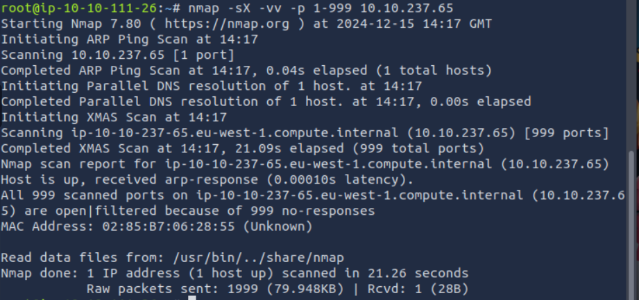
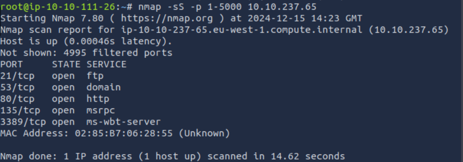

## Introduction

Ce TD nous présente la commande Nmap. Nmap permet de scanner des adresses IP afin de détecter les ports ouverts, les services actifs, ainsi que les systèmes d'exploitation utilisés par une machine cible.

## Mise en pratique

**Does the target ip respond to ICMP echo (ping) requests (Y/N)?**

Pour tester cela, j'utilise la commande `ping` sur l'adresse ip de la machine cible (10.10.237.65).

La commande ne renvoie rien, ça ne répond pas. La réponse est donc "N".

**Perform an Xmas scan on the first 999 ports of the target -- how many ports are shown to be open or filtered?**

Pour effectuer un Xmas scan sur les 999 premiers ports de la machine cible, on peut utiliser la commande `sudo nmap -sX -p 1-999 10.10.237.65`. L'option "-sX" indique de faire un Xmas scan, l'option "-p" spécifie que l'on souhaite scanner les ports 1 à 999.

Le retour de la commande nous indique que les 999 ports sont marqués comme "ouvert/filtré".

**There is a reason given for this -- what is it?**

L'option "-vv"permet d'augmenter la verbosité pour avoir plus d'informations.
`sudo nmap -sX -vv -p 1-999 10.10.237.65`

Le retour de cette commande nous indique que les 999 ports sont marqués "open|filtered" car il n'y a pas eu de réponse pour les 999 ports. Par défaut, quand il n'y a pas de réponse (no response), on marque les ports "open|filtered".

**Perform a TCP SYN scan on the first 5000 ports of the target -- how many ports are shown to be open?**

Pour effectuer un TCP SYN scan sur les 5000 premiers ports de la cible, on peut utiliser la commande suivante `sudo nmap -sS -p 1-5000 10.10.237.65`. L'option "-sS" permet d'effectuer un TCP SYN scan.

5 ports sont ouverts : le 21, le 53, le 80, le 135 et le 3389.

**Open Wireshark (see Cryillic's Wireshark Room for instructions) and perform a TCP Connect scan against port 80 on the target, monitoring the results. Make sure you understand what's going on. Deploy the ftp-anon script against the box. Can Nmap login successfully to the FTP server on port 21? (Y/N)**

Pour réaliser cela, dans wireshark, je lance la détection. Puis dans mon terminal, je tape la commande suivante `nmap -sT -p 80 10.10.237.65`. L'option "-sT" permet de faie un TCP Connect scan.

Maintenant, je peux executer le script ftp-anon avec l'option "--script" : `nmap --script=ftp-anon -p 21 10.10.237.65`

Le retour de la commande nous indique "FTP login allowed". La réponse est donc "Y".