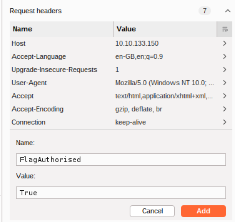
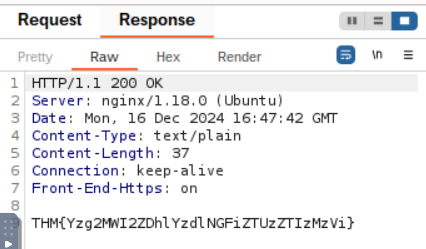
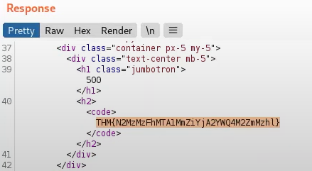
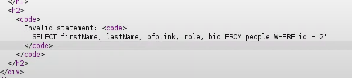
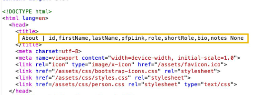
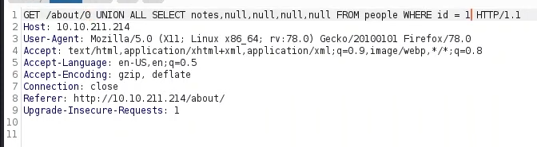
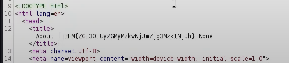

## Introduction

Ce TD nous présente l'outil Burp Suite. Burp Suite est un outil utilisé pour intercepter des requêtes HTTP/HTTPS, pour analyser les réponses des serveurs, et rechercher des vulnérabilités comme les injections SQL ou les failles XSS.

## Exemple pratique

Ici, on capture une requête http://10.10.133.150/ dans le module Proxy et on l'envoi à repeater.

Dans request header, j'ajoute un header "FlagAuthorised" avec la valeur "True". Puis on "send" la requête.

Dans l'onglet response, on peux maintenant voir le flag.

## Challenge

Maitenant, on intercepte une requête http://10.10.211.214/products/3 (ma machine a redémarré et donc l'url a changé). On envoie la reqête interceptée au repeater. La requête s'envoie bien, on ne remarque rien d'anormal.

On peut maintenant essayer de produire une erreur 500 en mettant l'id d'un produit qui n'exite pas sur le site web (par exemple -1) et on capture la requête (http://10.10.211.214/products/-1).

En examinant le code source html renvoyé dans la response, on découvre le 2e flag.

## Extra-mile Challenge

Comme indiqué dans la consigne, on commence par capturer une requête "http://10.10.211.214/about/2" et on l'envoie au repeater.

On peut maintenant ajouter une appostrophe à la fin de la reqête dans le repeater pour provoquer une erreur.

En descendant dans le code html de la response, on découvre une reqête SQL `SELECT firstname, lastName, pfpLink, role, bio FROM people WHERE id=2'`

Cette reqête correspond à la requête qui aurait dû être executée pour séléctionner les informations de l'utilisateur 2 que l'on recherche dans l'url, mais on remarque que l'apostrophe a empêché la reqête.

On a ici plusieurs infos utiles comme le nom de la table (people), ainsi que le nom de différentes colonnes de cette table.

Comme nous connaissons le nom de la table et le nombre de lignes, nous pouvons utiliser une requête d'union pour sélectionner les noms de colonnes de la table `people` à partir de la table `columns` et de la base de données `information_schema` par défaut.

Voici la requête à utiliser : `/about/0 UNION ALL SELECT group_concat(column_name),null,null,null,null FROM information_schema.columns WHERE table_name="people"`

Cela crée une requête d'union et sélectionne notre cible, puis quatre colonnes nulles (pour éviter que la requête ne génère une erreur). On modifie également l'id que nous voulons séléctionner (2 devient 0). En définissant l'ID sur un nombre non valide, nous nous assurons de ne rien récupérer avec la requête d'origine. Cela signifie que la première ligne renvoyée par la base de données sera notre réponse souhaitée à partir de la requête injectée. Enfin, "group_concat" permet de fusionner les noms des colonnes en une seule sortie.

On découvre ainsi 8 colonnes dans la table.

On a maintenant toutes les infos nécessaires pour trouver le flag. On clique sur le profil du PDG Jameson Wolfe sur la page web.

Puis grâce à la requête suivante, on peut récupérer le flag : `0 UNION ALL SELECT notes,null,null,null,null FROM people WHERE id = 1`

On envoi la requête et dans le code source de la response, on peut lire le flag :

