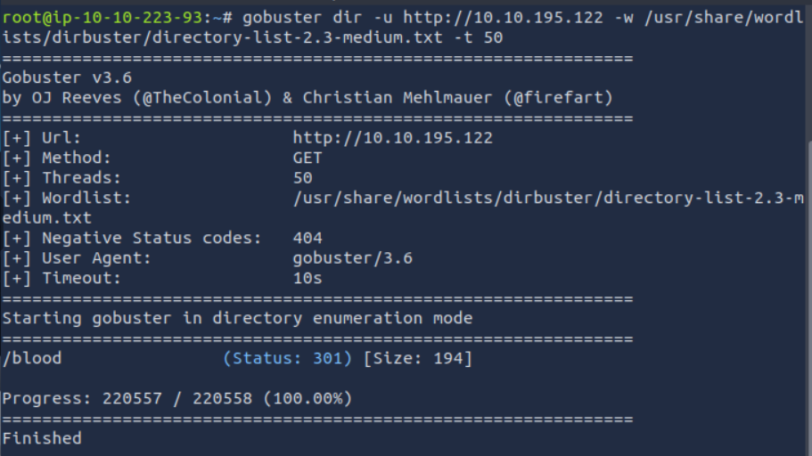
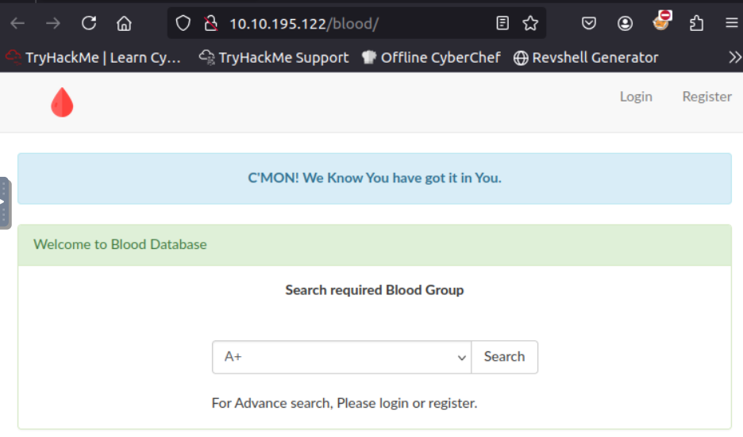
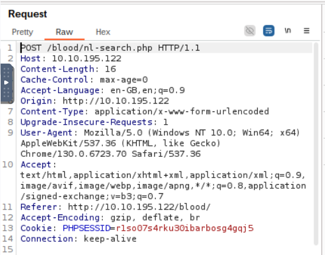
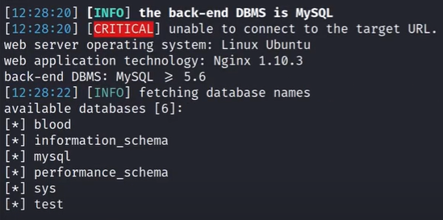
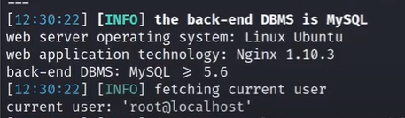
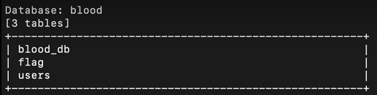
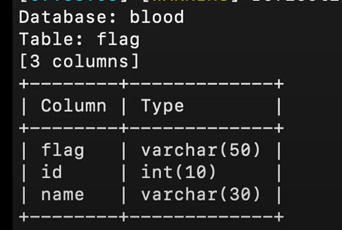
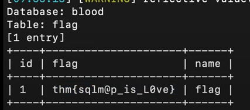

*Tout au long de ce tp, l'addresse ip cible varie à plusieurs reprises car ma machine virtuel a eu beaucoup de bug et a redémarré plusieurs fois*

## Introduction

Ce TD nous présente l'outil SQLMap. SQLMap est un outil open-source utilisé pour détecter et exploiter des vulnérabilités d'injection SQL dans des applications web. Il permet de tester des paramètres vulnérables, d'extraire des bases de données, des tables, ou encore des mots de passe en exploitant les failles des bases de données.

## Mise en pratique

Pour faire une première analyse, je vais utiliser gobuster, un outil qui permet de réaliser des ataques brutes force sur des répertoire et fichier d'un serveur.

La commande suivante permet de faire une analyse gobuster sur mon ip en utilisant le fichier de dictionnaire `wordlists/dirbuster/directory-list-2.3-medium.txt`. Il s'agit d'un fichier contenant une liste de mots à tester comme nom de répertoire ou de fichier. Je fais une analyse avec 50 threads qui permet de définir le nombre de requêtes simultanées effectuées (donc la vitesse d'execution de l'analyse).
 
`gobuster dir -u http://10.10.195.96/ -w /usr/share/wordlists/dirbuster/directory-list-2.3-medium.txt -t 50`

On constate que le mot "blood" ressort à la fin et on en déduit qu'il s'agit du répertoire que l'on doit analyser.

On se rend à l'url "10.10.195.96/blood" et on tombe sur cette page web.

On peut donc faire une analyse burp, on va intercepter une requête en appuyant sur le bouton "search". 

Puis on enregistre la sortie en fichier text "req.txt" pour pouvoir la traiter.

On peut mainntenant faire une analyse SQLmap sur ce fichier.

`sqlmap -r req.txt --dbs`

On découvre plusieurs bases de données, dont la base "blood".

La commande suivante nous permet de connaitre l'utilisateur courant.

`sqlmap -r req.txt --current-user`

"root" est l'utilisateur courant recherché.

Pour trouver le flag final, on va d'abord rechercher toutes les tables.

`sqlmap -r req.txt --tables`

Parmis la liste de tables, on retrouve une db "blood" qui contient 3 tables : blood_db, flag, users.

La commande suivante permet d'afficher plus en détail le contenu de chaque table avec ses colonnes. Je l'ai testé sur chacune des table et c'est dans flag que je trouve le flag final (logique).

`sqlmap -r req.txt -T flag --columns`

Ici, la table flag contient 3 colonnes : flag, id et name.

Je peux utiliser le parametre "dump" pour extraire les entrées de la table et cette commande me ressort le flag.

`sqlmap -r req.txt -T flag --dump`

