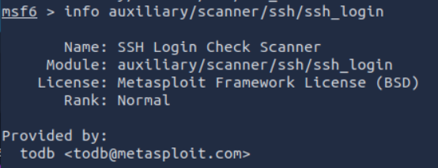

## Introduction

Ce TD nous présente l'outil Metasploit. Metasploit est un framework qui permet d'exploiter des vulnérabilités sur des systèmes informatiques. Il regroupe une large base de données d'exploits, de payloads, et d'outils de post-exploitation. Metasploit est couramment utilisé pour évaluer des failles de sécurité, et obtenir un accès privilégié à des machines cibles.

## Mise en pratique

Dans cette partie, on va apprendre à manipuler le framework metasploit en répondant aux questions du tryhackme.

### Main components of metasploit

**What is the name of the code taking advantage of a flaw on the target system?**

Une faille sur le système cible est appellé un "exploit".

**What is the name of the code that runs on the target system to achieve the attacker's goal?**

Un "Payload" est un morceau de code executé sur le système cible pour atteindre l'objectif de l'attaquant.

**What are self-contained payloads called?**

Les charges utiles autonomes sont appellées "singles"

**Is "windows/x64/pingback_reverse_tcp" among singles or staged payload?**

La charge envoie une requête ping de retour (pingback) vers l'attaquant via une connexion TCP. Tout le code requis pour executer cette action est inclu dans un seul payload donc c'es une charge utile simple ("singles").

### msfconsole

**How would you search for a module related to Apache?**

Pour rechercher un module lié à apache dans msfconsole, on peut utiliser la commande `search apache`.

**Who provided the auxiliary/scanner/ssh/ssh_login module?**

la commande `info auxiliary/scanner/ssh/ssh_login` nous indique que le module est fourni par "todb".

### Working with modules

**How would you set the LPORT value to 6666?**

La commande `set LPORT 6666` permet de définir LPORT à 6666. On peut vérifier que la commande s'est bien appliquée en tapant `show options`.

**How would you set the global value for RHOSTS to 10.10.19.23 ?**

La commande `setg` permet de définir une valeur globale. On peut donc définir la valeur globale de RHOSTS avec la commande suivante `setg RHOSTS 10.10.19.23`

**What command would you use to clear a set payload?**

La commande `unset payload` permet d'effacer un payload défini.

**What command do you use to proceed with the exploitation phase?**

Pour démarrer la phase d'exploitation, on peut simplement utiliser la commande `exploit` (après avoir défini tous les paramètres nécessaire).
